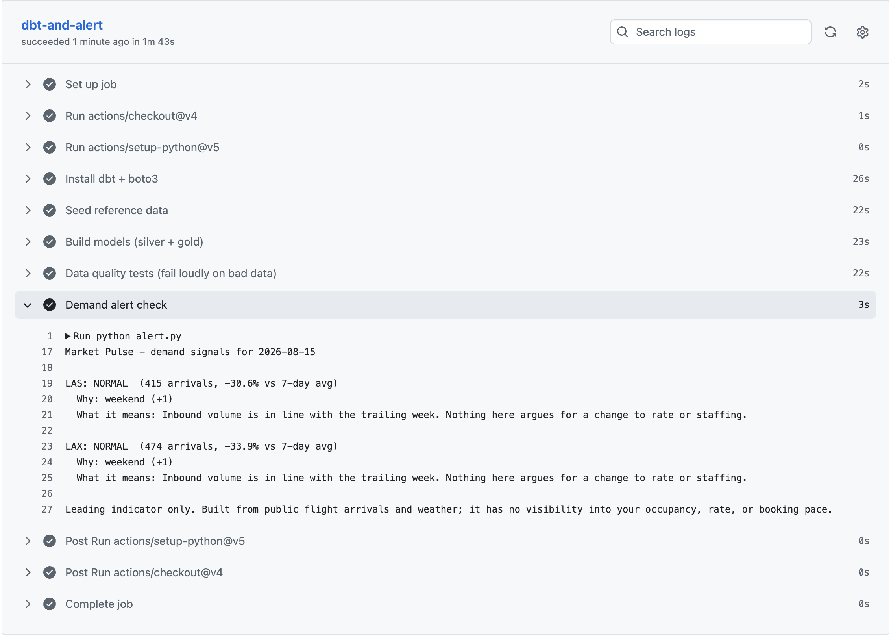
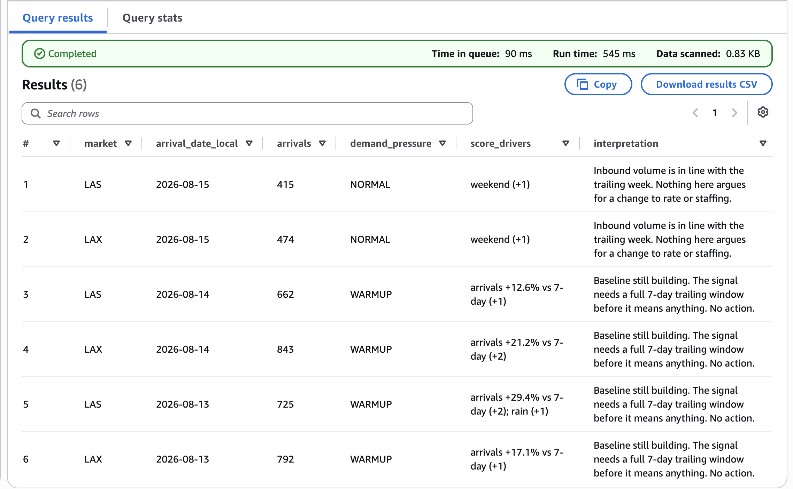
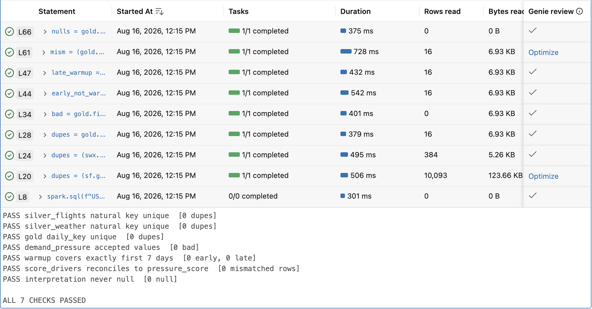

# Market Pulse

A hospitality demand-signal pipeline for Las Vegas and Los Angeles. Live
flight arrivals, weather, and calendar context become a daily
demand-pressure rating per market (NORMAL / ELEVATED / HIGH), with the
rules that fired, a plain-English interpretation, and an automatic email
alert on HIGH days.

**Stack:** AWS (S3, Lambda, EventBridge, Athena, Glue Data Catalog, SNS,
CloudWatch, IAM) · dbt · GitHub Actions · Databricks (PySpark + Delta
Lake) · DuckDB (local dev) · Python.

Runs autonomously at roughly $1/month.

## Architecture

```
 Open-Meteo ──▶ Lambda (daily, EventBridge cron) ──┐
                                                   ├─▶ S3 lake (raw, dt= partitions)
 OpenSky ──▶ GitHub Actions (hourly)  ─────────────┘        │
                                                            ▼
                                            Athena (partition projection,
                                                    no crawler)
                                                            │
                             GitHub Actions (daily) ──▶ dbt: staging (silver)
                                                        + marts (gold)
                                                        + 12 data quality tests
                                                            │
                                                    alert.py ──▶ SNS email on HIGH
```

Two ingestion paths on purpose. Weather runs as a Lambda on an
EventBridge schedule. Flights were designed the same way, but OpenSky's
[API policy](https://openskynetwork.github.io/opensky-api/rest.html)
blocks AWS and other hyperscaler IPs: the Lambda's requests were silently
dropped (connect timeouts), while the identical code succeeded from a
GitHub-hosted runner. A control experiment (weather Lambda reached its
API; flights Lambda timed out on the same network path) isolated the
block to OpenSky, so flight ingestion moved to GitHub Actions. The
downstream lake, catalog, transforms, and alerting are unchanged.

**Medallion layers.** Raw CSVs are immutable in S3. Silver
(`stg_flights`, `stg_weather`) types every column and deduplicates:
extraction windows overlap deliberately to survive OpenSky lag, so the
freshest extraction wins per natural key. Gold is
`mart_daily_demand_signals` (one row per market-day) and
`mart_hourly_arrival_curve`. Adding a market is one entry in `config.py`.

**No partition maintenance.** Athena uses partition projection: partition
locations are computed from the `dt=` path template, so there is no Glue
crawler, no `MSCK REPAIR TABLE`, and no daily registration job.



## The signal

`demand_pressure` is a transparent rules score: arrival momentum vs the
trailing 7-day average, weekend and holiday flags, curated major events,
and weather extremes. Rules-based by design: every point is explainable,
which beats a black box until occupancy ground truth exists to validate a
model against.

Each row also carries:

- **`score_drivers`** — exactly which rules fired and for how many points
  (`arrivals +29.4% vs 7-day (+2); rain (+1)`), so the score is auditable.
- **`interpretation`** — what the signal means and where a human should
  look next. It deliberately stops short of a recommendation: this feed
  has no visibility into occupancy, rate, or booking pace, so it is a
  leading indicator to pair with your own booking data, not a pricing
  decision.

The first 7 days per market are labeled WARMUP rather than scored against
an incomplete baseline.



## Databricks mirror (PySpark + Delta Lake)

The transform layer is implemented twice. The production path is
dbt-athena; `spark/` contains a full port to PySpark writing Delta Lake
tables on Databricks (bronze → silver → gold medallion), plus a
validation notebook with 7 hard assertions: natural-key uniqueness after
dedupe, gold grain, accepted label values, WARMUP covering exactly the
first 7 days, and `score_drivers` reconciling arithmetically to
`pressure_score`.

Both engines produce identical rows for identical inputs:

| Engine | LAS 2026-08-13 |
|---|---|
| Athena + dbt | 725 arrivals · WARMUP · `arrivals +29.4% vs 7-day (+2); rain (+1)` |
| Databricks + PySpark | 725 arrivals · WARMUP · `arrivals +29.4% vs 7-day (+2); rain (+1)` |



## Data quality

Twelve dbt tests gate every daily run (uniqueness, not-null, accepted
values on the pressure labels, presence of drivers and interpretation).
A failing test fails the GitHub Actions run loudly rather than shipping a
bad mart. The Spark side re-proves the same invariants independently.

## Security

Least-privilege IAM throughout: the weather Lambda's role can only
`PutObject` under one bucket prefix; the CI user is scoped to the
project bucket, Athena execution, the Glue catalog, and one SNS topic.
Credentials live in Lambda environment config and GitHub Actions secrets;
nothing sensitive is in the repo.

## Honest limitations

- **Leading indicator, not a forecast.** No occupancy, rate, or booking
  data flows in, so nothing here should be read as a pricing
  recommendation, and the alert text says so.
- **OpenSky blocks hyperscaler IPs**, which is why flights ingest from
  GitHub Actions rather than Lambda. Documented above because it shaped
  the architecture.
- **The most recent day is systematically undercounted** until the next
  hourly pull: arrival windows are UTC-bounded while dates are local, so
  each local day fills from two extraction runs. Steady-state hourly
  ingestion self-corrects; the effect is visible after backfills.
- **OpenSky coverage has gaps and lag.** Overlapping pulls plus dedupe
  recover most of it; warmup days are labeled WARMUP rather than guessed.
- **The events file is manually curated** (and stated as such).

## Repo map

```
extract_flights.py / extract_weather.py   stdlib-only extractors (local, Lambda, or CI)
dbt_project/                              staging + marts + tests + seeds (dbt-duckdb locally, dbt-athena in CI)
spark/                                    PySpark + Delta Lake port + validation (Databricks)
aws/                                      Athena DDL, least-privilege IAM policies
.github/workflows/                        hourly flights ingest + daily transform
alert.py                                  queries the mart, emails via SNS on HIGH
docs/img/                                 screenshots of the running system
```

## Roadmap

- Capture the first live HIGH alert email for this README.
- Extend the same config-driven pattern to entertainment release tracking
  (box office momentum).
